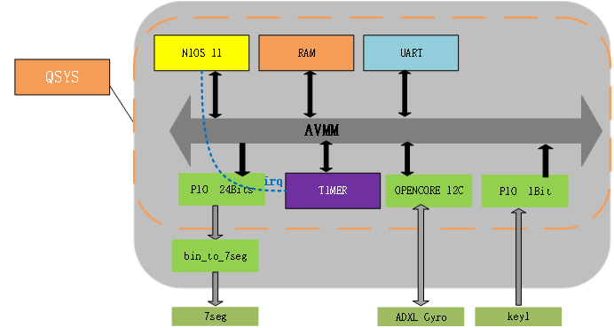
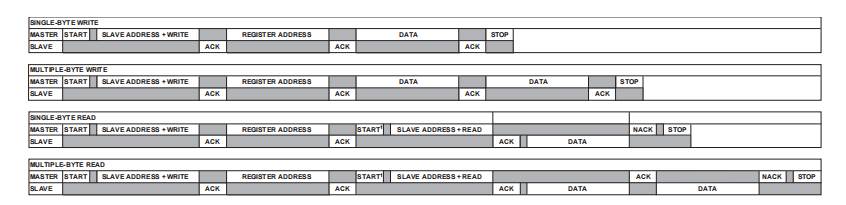
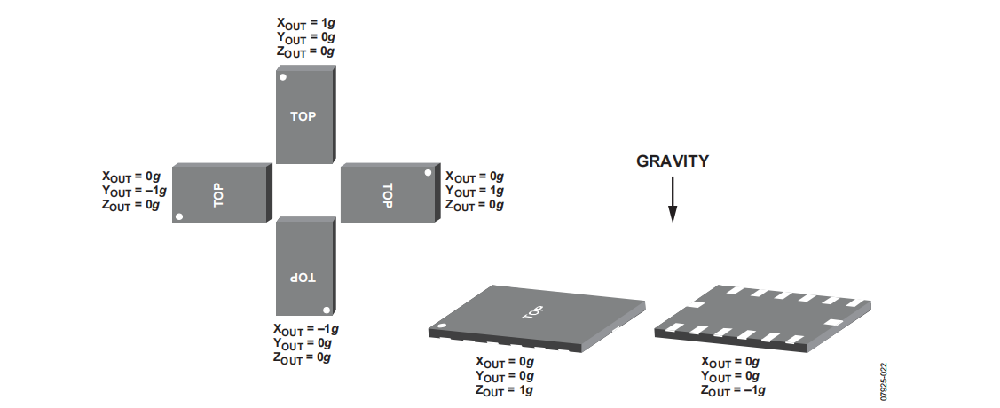

# HUANG_Lab3
## Introduction

Dans le dernier projet, un système plus complexe sera construit que les deux premiers. La partie principale du système est l'accéléromètre, avec lequel nous communiquerons via I2C. Affichez la valeur d'accélération collectée sur le tube numérique et changez la valeur d'accélération des axes x, y et z via la touche 1. En raison du dispositif d'accélération interne de la puce du capteur, nous devons le corriger en écrivant la valeur du registre interne sur le capteur avant la mesure formelle.

## System Architecture

Le schéma du système est illustré dans la figure 4. Par rapport aux deux premiers projets, nous avons ajouté un opencore I2C pour collecter les valeurs du capteur d'accélération. Une fois les données collectées sur le cœur logiciel, elles sont transmises via le port PIO pour être finalement affichées sur l'afficheur numérique. 

Lors de la création du système QSYS, il faut noter quelques différences par rapport aux projets précédents. Comme nous l'avons appris dans les pages 39 et 40 du manuel DE10-Lite, le capteur utilisé ici a 6 broches, dont 4 sont absolument définies (les deux autres sont des interruptions, non utilisées dans ce cas). Comme pour toute communication I2C, la broche de l'horloge (GSENSOR_SCLK) et la broche de données (GSENSOR_SDI) sont connectées aux broches SCL et SDA correspondantes de l'IP I2C d'opencores. La broche GSENSOR_CS_n est réglée sur 1 pour désactiver le SPI, et la broche GSENSOR_SDO, qui est utilisée pour sélectionner une adresse alternative lorsque le mode sélectionné est l'I2C, doit également être mise à 1 pour conserver l'adresse par défaut du capteur.

Selon le manuel du capteur ADXL345, pour lire et écrire les valeurs des registres à travers le protocole I2C, nous devons suivre le protocole de communication illustré dans la figure 5. 

Dans notre code, nous utilisons les fonctions de lecture et d'écriture en un seul octet, que nous avons intégrées sous les noms de fonctions write_byte et read_byte. Bien sûr, les fonctions de contrôle de lecture et d'écriture du protocole I2C, ainsi que les fonctions de démarrage et de signal d'arrêt, sont déjà fournies dans le composant opencore IIC. Nous n'avons qu'à ajouter le fichier opencores_i2c.c à notre projet pour pouvoir appeler ces fonctions.

### Principes de conception：
Nous avons écrit la fonction INIT_ADXL345(); pour initialiser le capteur. Cette fonction effectue principalement l'initialisation du protocole de communication I2C, puis nous initialisons le capteur. Selon le manuel de données du capteur, nous écrivons 0x08 à l'adresse 0x2D pour le POWER_CTL et 0x0B à l'adresse 0x31 pour contrôler le format des données lues. Ensuite, nous lisons l'état des boutons et définissons trois états différents, dans lesquels nous sortons respectivement les données de x, y et z.

Nous avons écrit une fonction g_data() pour lire les données. Cette fonction prend en entrée les adresses 1 et 2, puis convertit les valeurs correspondantes pour les transmettre à l'afficheur numérique. Prenons l'exemple de la lecture des données de l'axe X : selon le manuel de l'ADXL345, nous lisons les valeurs stockées aux adresses 0x32 et 0x33, et les stockons dans un registre. Ensuite, nous additionnons la valeur de l'adresse 0x33 décalée de 4 bits à gauche avec la valeur de 0x32. Comme les données sont stockées sous forme de complément à deux, nous les convertissons d'abord pour obtenir des données décimales signées. Puis, conformément au manuel du capteur, nous multiplions cette valeur par 3.9 pour obtenir la valeur réelle de l'accélération de l'axe X.

Ensuite, nous convertissons l'accélération de l'axe X lue en code BCD. Dans mon code, j'ai réglé pour que le bit de poids fort soit 0x0 pour les valeurs négatives, puis dans le code VHDL, nous déterminons que si le bit de poids fort est 0x0, l'afficheur numérique affiche un "-", pour exprimer l'effet d'un nombre négatif.

La lecture des données des axes Y et Z est similaire, avec les adresses respectives 0x34-0x35 et 0x36-0x37, que je ne détaillerai pas ici.

Enfin, nous affichons les valeurs de x, y et z sur l'afficheur numérique, en changeant d'affichage par la lecture des boutons.

### Calibration des données: 

Selon le manuel de l'ADXL345, en écrivant des valeurs aux adresses 0x1E, 0x1F et 0x20, nous pouvons calibrer respectivement les axes X, Y et Z.
Grâce à l'étape précédente, nous pouvons déjà mesurer l'accélération des axes X, Y et Z. Nous plaçons la carte de développement sur une surface plane et mesurons plusieurs fois les données des axes X, Y et Z. Selon le manuel de l'ADXL345, les valeurs normales pour les axes X et Y sont de 0 et l'axe Z doit indiquer 1g, comme illustré dans la figure 6. 

Nous mesurons dix fois dans chaque direction, puis calculons une valeur moyenne. Prenons l'axe X comme exemple : si la valeur moyenne mesurée sur l'axe X est de 16mg, d'après le manuel de l'ADXL345, 16mg / 15.6mg/lsb est approximativement égal à 1. Ensuite, nous écrivons la valeur 1 à l'adresse 0x1E pour effectuer la calibration. Il est important de noter que la calibration doit être effectuée après l'initialisation de l'appareil et avant d'écrire dans les registres. Pour les axes Y et Z, la procédure est similaire, à la différence que la valeur normale pour l'axe Z est 1g. En fonction des quantités de correction obtenues après calibration, notre compensation pour l'axe X est de 0 (nous écrivons 0 à l'adresse 0x1E), la compensation pour l'axe Y est de 3 (nous écrivons 3 à l'adresse 0x1F) et la compensation pour l'axe Z est de 1 (nous écrivons 1 à l'adresse 0x20). Après la calibration des données, lorsque la carte de développement est placée comme indiqué dans la figure 6, les valeurs correspondantes des axes X, Y et Z sont cohérentes avec la figure 6, indiquant que la calibration est correcte.

## Progress Results

## Conclusion

Dans ce lab, nous avons appris le processus de communication du protocole I2C, compris comment lire un manuel de données de puce, et comment lire et écrire les valeurs des registres d'une puce à partir de son manuel. La difficulté de ce labo résidait dans la manière de faire appel correctement à l'opencore fourni pour réaliser le processus de lecture et d'écriture demandé par le manuel de la puce. Lors des tests, nous avons rencontré un problème lorsque les données étaient négatives, les données testées n'étaient pas correctes. Après vérification, nous avons découvert que les données des registres internes de la puce étaient stockées sous forme de complément à deux. Par conséquent, lorsqu'une donnée est négative, il faut d'abord la convertir du complément à deux au code original, puis la convertir en données décimales.
